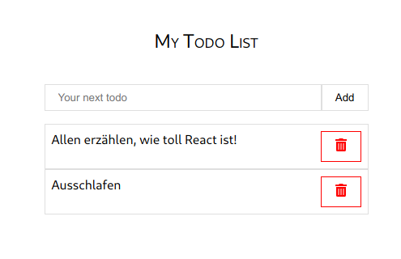

# React Todo-Liste

Hier ist das Template für eine Todo-Liste, die ihr vervollständigen sollt.

Ein paar Dinge sind schon gegeben:
Zum Beispiel ist bei vielen Komponenten schon die Grundstruktur vorhanden, sodass man sie einfach nur noch zusammenstecken muss.

Um das Projekt zu starten, einmal das Terminal in VSCode öffnen und zum Projekt navigieren:
```sh
$ cd templates/day2-12-react-todo-list-template
$ npm ci # installiert alle Abhängigkeiten
$ npm start # startet den Web-Server
```

Leider haben aber fast alle Komponenten noch keinen State und keine Props.
Überlegt euch, was man wo übergeben muss, damit man zum Beispiel ein Todo-Item zur Liste hinzugefügt wird!

Schaut euch einmal `AddItem.tsx` an. \
Macht euch klar, wie die Komponente funktioniert und stellt die Funktion wieder her,
die bei `Enter` im Input automatisch ein neues Todo-Item hinzufügt! (ohne auf den Button drücken zu müssen) \
Wo liegen die Fehler?

Zeigt uns am Ende eure Fortschritte und wir diskutieren über eure innovativen Lösungsansätze!

Falls ihr Fragen habt, kommt einfach auf uns zu und wir besprechen alles weitere.

Wenn ihr schon fertig seid, überlegt euch weitere sinnvolle Features, die ihr dann auch direkt implementieren könnt!

Viel Glück

Euer Groundstation Team

## About

This project was bootstrapped with [Create React App](https://github.com/facebook/create-react-app).

## Learn More

You can learn more in the [Create React App documentation](https://facebook.github.io/create-react-app/docs/getting-started).

To learn React, check out the [React documentation](https://reactjs.org/).
